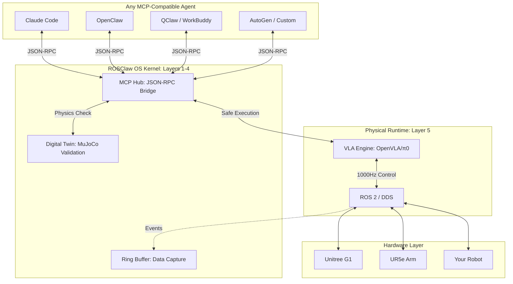

<div align="center">

# 🦾 ROSClaw

**The Universal OS Bridging Multimodal AI Agents with the Physical World.**

[](https://opensource.org/licenses/Apache-2.0)
[](https://docs.ros.org/)
[](https://mujoco.org/)
[](https://modelcontextprotocol.io/)

[English](README.md) • [中文文档](https://docs.rosclaw.io/zh) • [Architecture](#-architecture) • [Quick Start](#-quick-start) • [Discord](https://discord.com/invite/E6nPCDu6KJ)

<br/>

> *"Teach Once, Embody Anywhere. Share Skills, Shape Reality."*

</div>

<br/>

## 🌍 The Vision: Democratizing Physical AI

Phenomenal frameworks like **Claude Code, OpenClaw, and WorkBuddy** have democratized the digital world—empowering anyone to orchestrate AI teams to build software effortlessly.

**ROSClaw brings this exact revolution to the Physical World.**

We are not just building a bridge between LLMs and robots; we are building an **Open Ecosystem for Physical Skills**. If a developer in Tokyo teaches a robotic arm the "precision screwdriving" skill via ROSClaw, a factory worker in Berlin can instantly download that skill and deploy it on a completely different humanoid robot—**no re-programming required**.

By unifying heterogeneous hardware behind the universal Model Context Protocol (MCP) and abstracting physics through our OS kernel, we enable creators to **share, iterate, and deploy Embodied AI across thousands of industries**.

> **The future we imagine**: A skill marketplace where physical intelligence flows as freely as software—teach once, embody everywhere.

---

## ✨ Core Innovations

ROSClaw is an **Agent-Agnostic Embodied OS** built on four pillars:

### 1. 🌐 Universal MCP Hub
Plug-and-play with **ANY** AI Agent framework. We translate complex ROS 2 topics and DDS streams into clean JSON schemas that Claude Code, OpenClaw, or any MCP-compatible agent can command natively.

### 2. 🧠 Asynchronous Brain-Cerebellum Routing
Decouples the **Cognitive Brain** (LLMs at ~1Hz) from the **Physical Cerebellum** (ROS 2/VLA at 1000Hz). Network latency or LLM delays never compromise physical stability.

### 3. 🛡️ Digital Twin Firewall (MuJoCo)
LLM hallucinations in the physical world are catastrophic. Before any command executes, it is fast-forwarded in a **Headless Digital Twin (MuJoCo)**. If collision or torque overload is predicted, the action is blocked and the Agent self-corrects.

### 4. 🔄 Skill Flywheel (TODO)
Every execution feeds an Event-Driven Ring Buffer. Data is packaged into `LeRobot` formats to continuously fine-tune VLA models. **Talk to Train**—evolve your robot's physical intuition daily.

---

## 🗺️ Architecture: Agent-Agnostic by Design



**Key Insight**: Layers 1-4 form the stable kernel. Any Agent (Layer 6+) can connect via MCP without hardware-specific knowledge.

---

## 🚀 Quick Start

Zero configuration. Native compatibility. Get your robot online in 30 seconds.

### 1. Install ROSClaw OS Kernel

```bash
curl -sSL https://rosclaw.io/get | bash
```

### 2. Plug into ANY Agent Framework

**Claude Code:**
```bash
claude mcp add rosclaw -- rosclaw-hub --auto-discover
# Then: "Claude, move the UR5 arm to home position and validate first"
```

**OpenClaw / WorkBuddy (mcp_servers.json):**
```json
{
  "mcpServers": {
    "rosclaw-embodiment": {
      "command": "rosclaw-hub",
      "args": ["--enable-digital-twin"]
    }
  }
}
```

---

## 🎯 Roadmap: Where We're Going

| Phase | Status | Key Deliverables |
|-------|--------|------------------|
| **1** | ✅ | Digital Twin Firewall, UR5 MCP Server, MuJoCo models |
| **1.5** | 🚧 | Testing (42 tests), CI/CD, PyPI release |
| **2** | 📋 | Data Flywheel, OpenVLA/π0 integration, Skill library |
| **3** | 📋 | G1/Panda support via sdk_to_mcp, ClawHub skill marketplace |
| **4** | 🔮 | Neural Twin, Multi-agent collaboration, TSN |

### Active TODOs
- [ ] Replace print with logging module
- [ ] YAML configuration for model paths
- [ ] PyPI release v0.1.0
- [ ] sdk_to_mcp integration docs

---

## 💎 Supported Embodiments & Ecosystem

We are actively unifying all hardware through our official south-bound drivers:

*   **Unitree G1** (via `rosclaw-g1-dds-mcp`)
*   **Universal Robots (UR5e)** (via `rosclaw-ur-ros2-mcp`)
*   **General PTZ Gimbals** (via `rosclaw-gimbal-mcp`)

### 🚀 sdk_to_mcp: Zero-Code Hardware Integration

Have a new robot with an SDK? Our **[sdk_to_mcp](https://github.com/ros-claw/sdk_to_mcp)** toolchain auto-generates MCP servers from official SDK documentation—**no manual driver development required**.

```bash
# Example: Generate MCP server from robot SDK docs
python -m sdk_to_mcp generate --sdk-doc robot_sdk.pdf --output rosclaw-newrobot-mcp
```

---

## 🛡️ Safety Architecture

### Digital Twin Firewall

Every motion is validated in MuJoCo before physical execution:

```python
from rosclaw.firewall import DigitalTwinFirewall, mujoco_firewall, SafetyLevel

# Method 1: Direct validation
firewall = DigitalTwinFirewall("src/rosclaw/specs/ur5e.xml")
result = firewall.validate_trajectory(trajectory_points)
if not result.is_safe:
    raise SafetyViolationError(f"Unsafe: {result.violation_details}")

# Method 2: Decorator
@mujoco_firewall(model_path="ur5e.xml", safety_level=SafetyLevel.STRICT)
def execute_motion(trajectory):
    # Only runs if validation passes
    ...
```

### Validation Checks

- **Collision Detection**: Self-collision and environment collision
- **Joint Limits**: Position, velocity, and torque limits
- **Workspace**: TCP position within safe bounds
- **Smoothness**: Jerk and acceleration limits

---

## 🙏 Acknowledgements

ROSClaw stands on the shoulders of giants:
*   **The Agent Ecosystem (OpenClaw, Claude Code, etc.)**: For pioneering the digital workflows that inspired our physical architecture.
*   **[RoboClaw](https://github.com/MINT-SJTU/RoboClaw)**: For pioneering the Embodied closed-loop and Entangled Action Pairs (EAP).
*   **[mjlab](https://github.com/mujocolab/mjlab)**: For providing the blazingly fast MuJoCo backend that powers our Digital Twin Firewall.

---

<div align="center">
  <b>Bridging AGI to the Physical Universe.</b><br>
  <a href="https://rosclaw.io">rosclaw.io</a>
</div>
